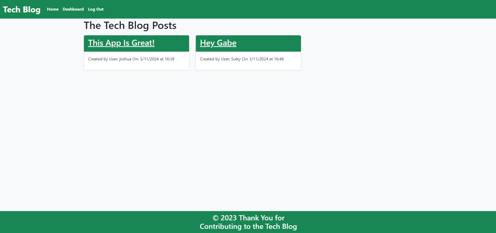
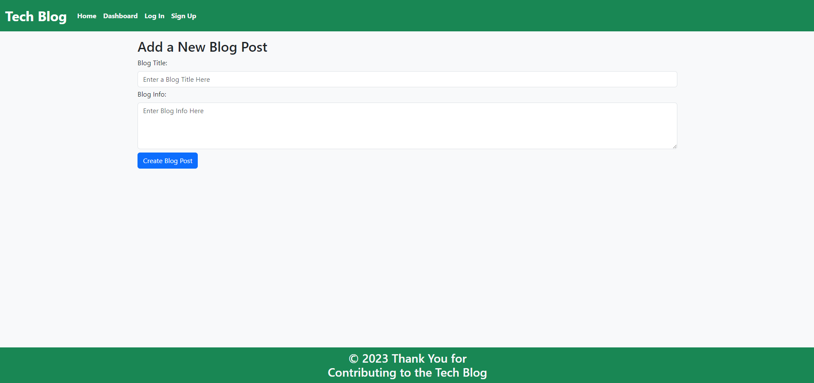
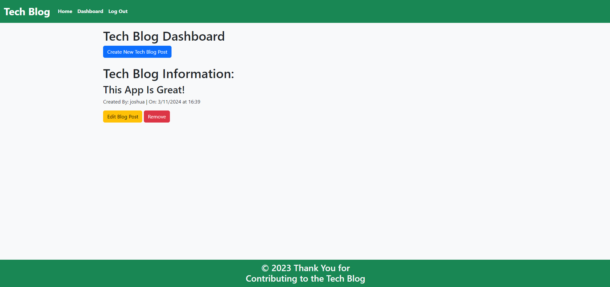
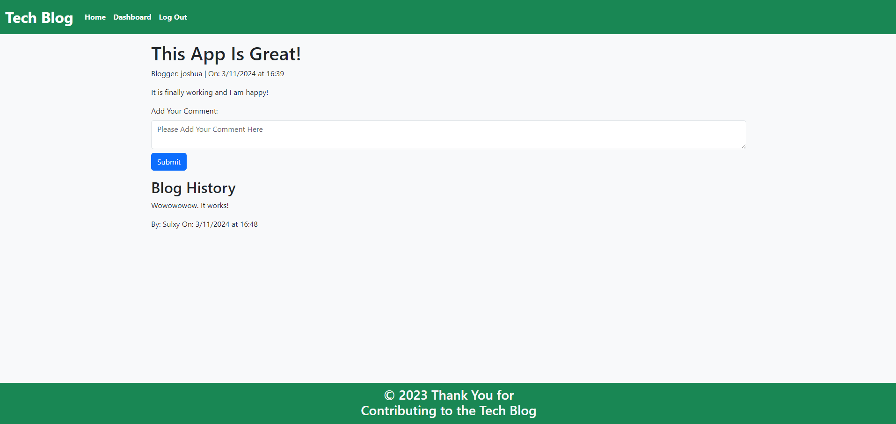

# MVC Tech Blog

## Table of Contents

* [Description](#description)
* [Installation](#installation)
* [Usage](#usage)
* [Credits](#credits)
* [Screenshots](#screenshots)
* [Video](#video)
* [Link to Website](#link-to-website)
* [License](#license)

## Description

## Installation

## Usage

## Credits

Guidance Provided by AskBCS Learning Assistant: "Masi" (Username: mmasinga)

Guidance Provided by AskBCS Learning Assistant: "Chipo" (Username: cphiri)

Tutor Assistance Provided by Katherine Redford

YouTube Channel Accessed for Function Guidance: https://www.youtube.com/@thoscalle4104 by Thomas Calle

Project Done in Collaboration with coding students Kalyn Sifuentes, Joshua Hale, Angela Cortes, and Joseph Henry

## Screenshots

Home Screen:

Create Post Screen:

Edit Post Screen:

Add Comment Screen:

## Video

N/A

## Link to Website

Link to Heroku Deployed Website: https://arcane-brook-36149-6bb081aaa15e.herokuapp.com/

## License

This application is licensed under the Apache 2.0 License.

https://opensource.org/licenses/Apache-2.0